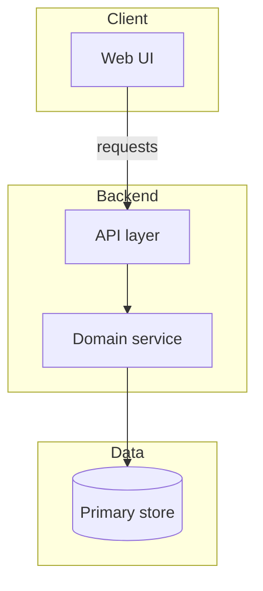
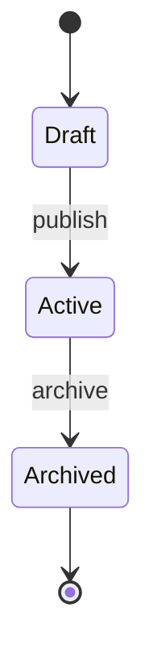
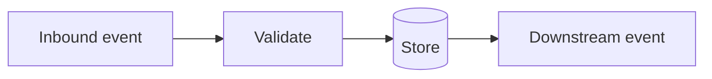
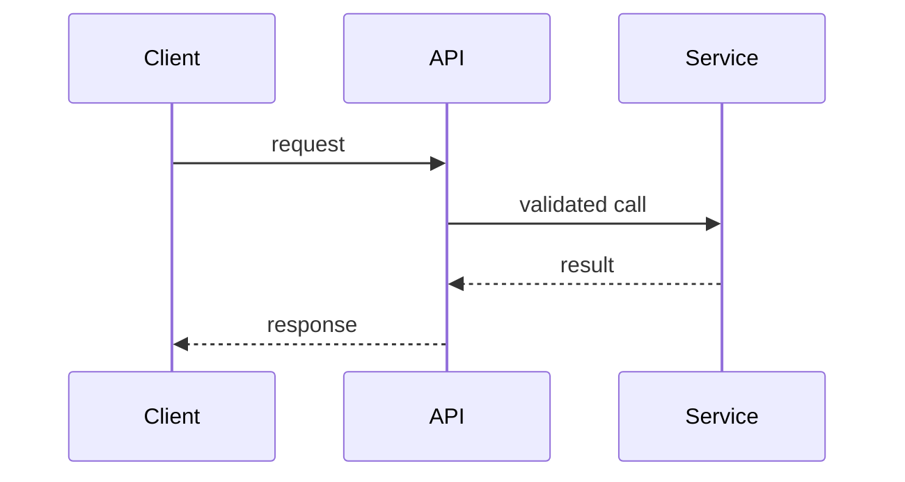

# Technical Design: [FEATURE NAME]

**Feature**: [FEATURE NAME]
**Created**: [DATE]
**Status**: Draft

> Authoring note (not emitted in the generated document): write every prose section to follow the humanization guide at `templates/humanization-guide.md` - plain English, varied cadence, no AI-tell phrases, no em dash.

## Summary

> Two to four sentences (what is being built technically and the key architectural approach), then the context fields. Enough for a tech lead to grasp scope at a glance.

[Paragraph.]

**Current state**: [The relevant part of the system as it exists today, one sentence.]
**Affected layers**: [Comma-separated: e.g. frontend, API layer, data layer, background jobs, infra.]
**Constraints**:

- [Non-measurable design rule or boundary from plan.md or spec.md: backward compatibility, library policy, a must-not behavior. Measurable numeric targets go in the Non-Functional Requirements table, not here.]
- [Constraint 2]

## Non-Functional Requirements _(optional)_

> Only when the source states measurable quality targets (latency, throughput, availability, accuracy, accessibility). Map each to an ISO 25010 category and a numeric target, plus how it is verified. State numbers, not adjectives ("p95 under 250 ms", not "fast"). This table is the single home for numeric targets; do not also list them as Constraints bullets. Omit when the source names no measurable target.

| Quality attribute (ISO 25010)                                                                                                                                                          | Target                                     | How verified                                |
| -------------------------------------------------------------------------------------------------------------------------------------------------------------------------------------- | ------------------------------------------ | ------------------------------------------- |
| [One of the 8 ISO 25010 categories: Functional suitability / Performance efficiency / Compatibility / Interaction capability / Reliability / Security / Maintainability / Flexibility] | [Numeric target with units and conditions] | [Test, monitor, or review that confirms it] |

## Architectural Approach

> 3-6 paragraphs. How the solution fits the existing architecture, which components are added, changed, or removed, how they connect, and why over alternatives. Reference component and module names. State the key design principles. No code.

[Paragraphs here.]

> Diagram: a `flowchart` of how the components connect. Group layers (frontend, API, data, jobs) into `subgraph` blocks, C4 container/component level. Only nodes and edges named in the prose above.



> State diagram (only when the source describes a lifecycle or state machine): a `stateDiagram-v2` for the entity or process whose states are named in the source. Omit otherwise.



## Affected Modules

| Module / Component | Change                           | Responsibility                                   |
| ------------------ | -------------------------------- | ------------------------------------------------ |
| [name]             | adds / modifies / removes / uses | [One sentence: what it does and why it changes.] |
| [name]             | adds / modifies / removes / uses | [One sentence.]                                  |

## Data Design _(optional)_

> Only when `plan.md`, `spec.md`, or `data-model.md` has data model information. Omit otherwise.

### Data Model

> Key entities and their main fields at shape level. Enough for a reviewer to understand the data contract. No full ORM schema or migration DDL. Plain text blocks.

```text
[Entity name]
- [field]: [type] - [purpose or constraint]
- [field]: [type]
```

### Data Flow

> How data moves: what triggers creation or mutation, where it persists, what events flow downstream.



## API Design _(optional)_

> Only when the feature exposes or modifies an API surface. Endpoint or operation shapes at a conceptual level: request and response shapes, key error cases, important constraints. Not a full OpenAPI spec. Omit otherwise.

```text
[METHOD] [/path]
  Request:  [key fields and types]
  Response: [key fields and types]
  Errors:   [HTTP status or error code]: [meaning]
```

> Diagram: a `sequenceDiagram` of the request/response interaction between the caller and the services that handle it. Include the key error path when the source describes one.



## Spec Coverage _(optional)_

> Only when `spec.md` has use cases or Gherkin scenarios. Map each to the component or operation that implements it. Flag gaps with "GAP" in the Notes column.

| Use Case                                | Component / Operation        | Notes                               |
| --------------------------------------- | ---------------------------- | ----------------------------------- |
| [Gherkin scenario title or use case ID] | [component name or endpoint] | [key constraint, edge case, or gap] |

## Key Technical Decisions _(optional)_

> One subsection per significant decision. Omit when plan.md has no explicit design choices.

### [Decision title]

**Context**: [What constraint or trade-off forced a decision.]
**Options considered**:

- [Option A: brief pros and cons]
- [Option B: brief pros and cons]

**Decision**: [What was chosen and the primary reason.]
**Consequences**:

- Positive: [What this enables or simplifies.]
- Negative: [Trade-off, future debt, or lock-in introduced.]

## Testing Strategy

- **Unit**: [Modules, functions, or classes to cover. Focus on non-trivial logic.]
- **Integration**: [Cross-component or cross-service flows to verify end-to-end at the service level.]
- **E2E / BDD**: [Spec scenarios to automate as priority. Reference use case IDs when available.]
- **Observability**: [Key metrics, log events, or traces needed to validate correctness in production.]

## Rollout and Migration

**Strategy**: [Feature flag / dark launch / gradual rollout / big bang. State which and why.]
**Data migration**: [Steps, reversibility, and risk level. Write "None" if no migration is needed.]
**Rollback**: [How to revert if something goes wrong after deployment.]

## Risks and Mitigations _(optional)_

> Only when plan.md or spec.md has concrete technical risk signals. Scope to technical and architectural risks; product risks live in the spec and delivery risks in the plan, so do not restate them here. Omit otherwise.

**[Risk title]**

- **What could go wrong**: [One sentence including consequence.]
- **Probability**: [Low / Medium / High]
- **Impact**: [Low / Medium / High]
- **Mitigation**: [What is in place or planned to reduce this risk.]

## Open Questions _(optional)_

> Only when unresolved technical decisions remain. Scope to technical questions; product open questions live in the spec, delivery questions in the plan. Omit otherwise.

- [Technical open question, one sentence.]
