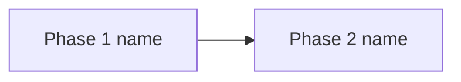

# Product Plan: [FEATURE NAME]

**Feature**: [FEATURE NAME]
**Created**: [DATE]
**Status**: Draft

> Authoring note (not emitted in the generated document): write every prose section to follow the humanization guide at `templates/humanization-guide.md` - plain English, varied cadence, no AI-tell phrases, no em dash.

## Summary

> One short paragraph on the main approach and how the work is structured. Do not restate the problem or who it is for; those live in the spec. No code, no file paths, no time estimates. Technical terms glossed on first use.

[One paragraph.]

## Goals and Non-Goals

> Two short lists scoped to this delivery effort. Goals are the outcomes that mark this build done. Non-goals are deliberate delivery exclusions with a one-phrase reason. Do not restate the spec's Scope bullets; this is about what shipping looks like, not product capabilities. Always populate non-goals; if it feels empty, look harder.

**Goals**:

- [Concrete outcome this feature delivers, one sentence.]
- [Concrete outcome this feature delivers, one sentence.]
- [Concrete outcome this feature delivers, one sentence.]

**Non-goals**:

- [Capability deliberately excluded, one short reason.]
- [Capability deliberately excluded, one short reason.]

## Delivery Phases

> Roadmap: a `flowchart LR` of the phases. One node per phase; an edge from each prerequisite to the phase that names it under "_Depends on_". Render only when dependencies branch; a single chain or independent phases adds nothing over the list. Omit with fewer than two phases. No dates or durations.

### Phase 1: [Name]

- [What this phase delivers or enables, one sentence.]
- [What this phase delivers or enables, one sentence.]

### Phase 2: [Name]

_Depends on_: Phase 1.

- [What this phase delivers or enables, one sentence.]
- [What this phase delivers or enables, one sentence.]

## Risks and Mitigations _(optional)_

> Only when the source plan has concrete delivery risk signals. Scope to delivery and sequencing risks; product risks live in the spec and technical risks in the design doc, so do not restate them here. Omit otherwise.

**[Risk title]**

- **What could go wrong**: [Description and consequence, one sentence.]
- **Probability**: [Low / Medium / High]
- **Impact**: [Low / Medium / High]
- **Mitigation**: [What reduces the impact, one sentence.]

## Divergences and Edge Cases _(optional)_

> Only when the source plan describes scenarios that deviate from the normal flow. Omit otherwise.

- **[Scenario]**: [What it is and how the system handles it, one to two sentences.]

## Validation _(optional)_

> Only when the source plan defines explicit acceptance criteria. Omit otherwise.

- [Observable condition that confirms a part of the feature is correct, one sentence.]

## Open Questions _(optional)_

> Only when the source plan has open delivery questions or marked assumptions. Scope to delivery; technical open questions live in the design doc, product open questions in the spec. Omit otherwise.

- [Open delivery question, one sentence.]
