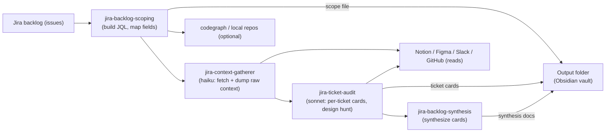

# Workflow overview — concepts

The pipeline explained conceptually: what it does, what it reads, and the rules it follows. For how to *run* it see the [guides](guides/) and the [prompts cookbook](guides/prompts.md); for setup see [SETUP](SETUP.md); for who-does-what see the reference tables in [WORKFLOW.md](../WORKFLOW.md).

## Short summary

- **Purpose:** scope a backlog, audit each ticket for readiness, and synthesize cross-cutting planning artifacts (master table, executive summary, readiness plan).
- **Read-only:** the pipeline only reads Jira, Notion, Slack, Figma, and GitHub. It never writes to Jira or any external system — the only writes are markdown files on disk, and no agent is even granted a write tool (verified live by the `doctor` preflight, not by an after-the-fact report).
- **Output:** an Obsidian-style folder, split by issue type — `objectives/`, `milestones/`, `stories/` — plus either the 10-document synthesis package (leaf-ticket scope) or one condensed `MILESTONE_PLAN.md` (Objective-scoped run).

## Pipeline (three phases)

1. **Scope** (`jira-backlog-scoping`) — build an explicit JQL scope, map `customfield_XXXXX` → readable labels, and deduce & verify the multiplicative RICE-style model: `Score = Impact × Confidence × Size factor`. Output: scope JQL, key list, field map, verified scoring model. If the scope boundary itself is genuinely contested, this phase self-flags for an Opus re-resolve rather than guessing.
2. **Audit** (`jira-ticket-audit`) — process tickets in small batches (~3), first branching on issue type (Step 0). **Leaf tickets** (Story/Task/Bug) get the full treatment: a **Gather** sub-stage (`jira-context-gatherer`, Haiku) fetches each ticket, its remote links, one hop of linked tickets, and any Notion/Slack/GitHub/Figma links, dumping it verbatim; then an **Analyze** sub-stage (`jira-ticket-auditor`, Sonnet) reads that dump and evaluates the four axes (goal/scope clarity; UI/design need; size coherence with a recomputed Score; prioritization soundness), runs the five-place design hunt, associates tickets to repos/code, and writes one Obsidian card per ticket (`stories/`) ending in a Definition-of-Ready block. **Grouping tickets** (Objective/Milestone) skip all of that: their children are discovered via the native `parent` field, an Objective gets a short index card (`objectives/`), and each Milestone gets its own card (`milestones/`) with a condensed sprint-fit verdict. Run standalone (not via the workflow), the auditor does both retrieval and judgment itself.
3. **Synthesize** (`jira-backlog-synthesis`) — for a leaf-ticket scope, roll the cards into the 10-doc planning package: master table (Score re-verified), executive summary, cross-cutting findings, readiness plan grouped by DoR verdict, design & code reviews, tickets-by-project, thematic grouping. For an Objective-scoped run, write one condensed `MILESTONE_PLAN.md` instead.

You can run the full chain end-to-end or invoke a subagent per phase — see [backlog-audit](guides/backlog-audit.md) for the run modes.

## Visual pipeline (Mermaid)

## What the workflow looks at

- **Jira issue fields** — summary, description, status, priority, assignee, Sprint, custom fields (Score/Impact/Confidence/Size), attachments, issue links, remote links.
- **Remote links and attachments** — Figma often hides in `remoteIssueLinks`.
- **Notion pages** linked from a ticket — Acceptance Criteria frequently live in Notion; pages are opened and extracted read-only.
- **Slack threads/channels** referenced by URL — read and summarized for decisions/links.
- **GitHub PRs/issues** referenced in tickets — fetched via `gh` for title/state/body and embedded links.
- **Local code repositories** (optional) — characterise repos (README/language), then `codegraph_*` tools or scoped `rg` sweeps for ticket → repo mapping.

## Decisions & rules the workflow follows

- **Confirm scope first.** Board, team, project, and what defines the backlog are confirmed (or passed in `args`) before any Jira query.
- **Score model.** Deduce the RICE-style mapping and verify the arithmetic on real issues. If Score can't be reconciled (Score == 0), label it "scoring incomplete" rather than assume a formula error.
- **Design hunt.** Check five places (design fields, attachments, description/AC, issue links, remote links) and record where a design was found — or that none was.
- **Linked-ticket recursion.** Follow one hop (subtasks & issue links), hunt each linked ticket, cap at ~8 per parent.
- **Notion as AC.** A Notion link counts as Acceptance Criteria only if the page was opened and actually contains AC; otherwise it's "linked but unreadable". A Notion coverage registry is built per audit.
- **Definition of Ready.** Every ticket gets one verdict (🟢 Ready / 🟡 Almost ready / 🔴 Not ready) and a 7-point checklist. Inferred items are marked `🔎 deduced (to verify)`, never ✅ until confirmed.
- **Code association.** Prefer `codegraph` MCP tools; otherwise scoped per-repo `rg`. Characterize a repo by its README and manifest before searching.
- **No invention.** Missing data is `Not recorded` / `Uncertain`, never guessed.

## Inputs / outputs & file conventions

- **Output folder** is an Obsidian vault, split by issue type: `objectives/`, `milestones/`, `stories/`. Each card is `<KEY>-<kebab-slug>.md` and opens with YAML frontmatter — leaf cards use `ticket`/`dor`/`score`/…; Objective/Milestone cards use `objective`/`milestones`/`sprint_fit` instead.
- **Synthesis documents** are ordered and frontmattered (index, executive summary, master table, cross-cutting findings, plan/recommendation, methodology & scoring, design/code reviews, tickets-by-project, thematic grouping) — or, for an Objective-scoped run, a single `MILESTONE_PLAN.md`.
- **No actions-audit document.** Read-only safety is enforced by each agent's tool allowlist and the `doctor` preflight, not by a separate proof file.

---

For step-by-step guides and copy-paste prompts, see [WORKFLOW.md](../WORKFLOW.md) and [docs/guides/](guides/).
